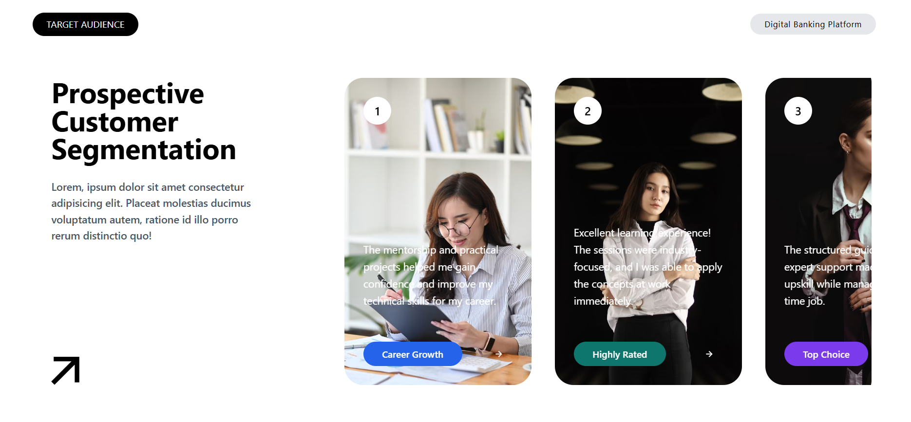
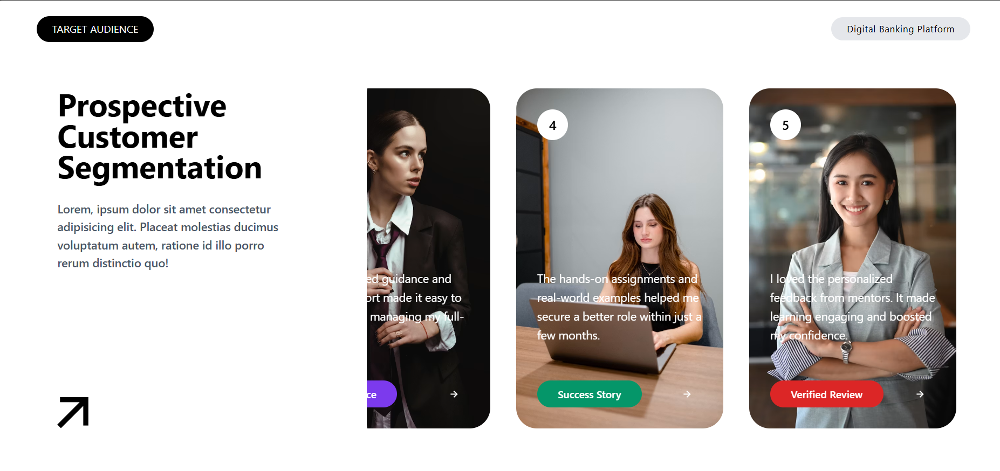

# React UI Project – Target Audience Segmentation ⚛️🎨

This project focuses on building a **modern customer segmentation interface** using **React.js**, **Vite**, and **Tailwind CSS**. The UI displays a collection of customer profile cards with professional images, descriptions, and color-coded tags while following a reusable component-based architecture.

---

## 📌 About This Project

In this project, I built a **Target Audience Segmentation** interface that showcases prospective customer profiles in a clean, modern, and responsive layout.

The application is divided into reusable React components such as a navigation bar, hero section, customer cards, and content containers. Customer information is rendered dynamically using JavaScript's `map()` method, making the UI scalable and easy to maintain.

---

## 🚀 What I Learned

* Creating reusable React components
* Passing data using props
* Rendering lists dynamically with `map()`
* Organizing components using a feature-based folder structure
* Styling modern interfaces using Tailwind CSS
* Building responsive layouts with Flexbox
* Passing multiple props between parent and child components
* Using dynamic colors for UI elements
* Working with external image URLs
* Integrating Remix Icons into a React project

---

## ✨ Features

* Modern Landing Page UI
* Responsive Layout
* Reusable Component Architecture
* Dynamic Customer Cards
* Horizontal Scrollable Cards
* Professional Profile Images
* Color-Coded Customer Tags
* Hero Section
* Navigation Bar
* Image Overlay Card Content
* Clean and Minimal Design

---

## 🛠️ Technologies Used

* React.js
* Vite
* Tailwind CSS v4
* JavaScript (ES6+)
* HTML5
* Remix Icons

---

## 📸 Project Preview

### Home Page





---

## 📂 Folder Structure

```text
src/
│
├── assets/
│
├── components/
│   └── Section1/
│       ├── Arrow.jsx
│       ├── HeroText.jsx
│       ├── LeftContent.jsx
│       ├── Navbar.jsx
│       ├── Page1Content.jsx
│       ├── RightCard.jsx
│       ├── RightCardContent.jsx
│       ├── RightContent.jsx
│       └── Section1.jsx
│
├── App.jsx
├── App.css
├── index.css
└── main.jsx

package.json
vite.config.js
```

---

## 🛠️ Installation

### 1️⃣ Clone the Repository

```bash
git clone https://github.com/Nilakshi2006/07-UI-Project.git
```

### 2️⃣ Navigate to the Project Folder

```bash
cd 07-UI-Project
```

### 3️⃣ Install Dependencies

```bash
npm install
```

### 4️⃣ Start the Development Server

```bash
npm run dev
```

Visit

```
http://localhost:5173
```

---

## 🧩 Component Overview

### 🏠 Navbar

Displays the project title and category badge.

### 📝 HeroText

Displays the main heading and introductory description.

### ➡️ Arrow

Displays the decorative arrow using Remix Icons.

### 📄 LeftContent

Combines the HeroText and Arrow components.

### 🖼️ RightContent

Loops through customer data using `map()` and renders customer cards.

### 👤 RightCard

Displays the customer's image and overlay content.

### 💬 RightCardContent

Displays:

* Customer Number
* Customer Description
* Customer Tag
* Action Button

### 📦 Section1

Main section that combines the Navbar and Page Content.

---

## 📊 Dynamic Data Structure

Each customer card is generated dynamically using an array of objects.

```javascript
{
    img: "",
    intro: "",
    tag: "",
    color: ""
}
```

Example

```javascript
{
    img: "https://...",
    intro: "The mentorship and practical projects helped me gain confidence...",
    tag: "Career Growth",
    color: "#2563EB"
}
```

---

## 🎨 Styling

Tailwind CSS is used throughout the project for utility-first styling.

Global stylesheet (`index.css`)

```css
@import "tailwindcss";

#right::-webkit-scrollbar {
    display: none;
}
```

---

## 🎯 Learning Outcome

After completing this project, I can:

* Build reusable React components.
* Organize projects using a feature-based folder structure.
* Pass data efficiently using props.
* Render dynamic content with JavaScript `map()`.
* Design responsive layouts using Tailwind CSS.
* Build scalable and maintainable UI components.
* Create modern customer card interfaces.
* Improve code readability through component separation.
* Build professional React applications using Vite.

---

## 🚀 Future Improvements

* Add GSAP animations
* Add Framer Motion transitions
* Connect to a Backend API
* Implement Search & Filtering
* Add Dark Mode
* Add Card Hover Animations
* Improve Mobile Responsiveness

---

## 👩‍💻 Author

**Nilakshi**

GitHub: https://github.com/Nilakshi2006
